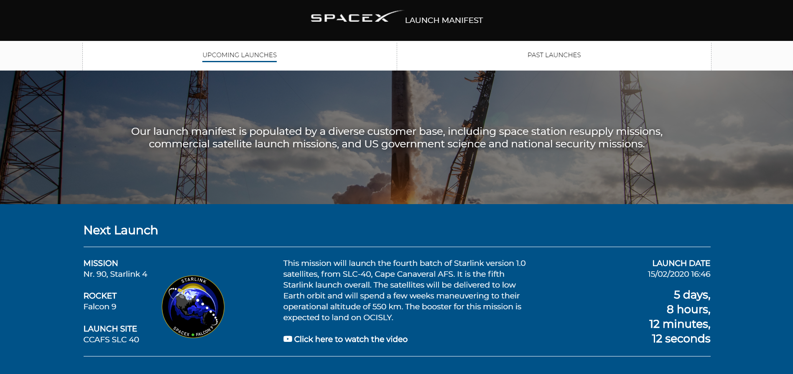

# SpaceX History

This application provides an overview of all past and upcoming SpaceX Rocket launches. On the one page it showcases the next launch with a countdown timer and some info on the mission, launch site and rocket type as well as a list of all upcoming launches. On the second page, it showcases the latest rocket launch as well as a list of all past launches.

## Contents
1. [Installation](#Installation)
2. [Features](#Features)
3. [API](#API)
4. [Actors and Interactions](#Actors-and-Interactions)
5. [License](#License)

## Installation
To work on this project, 
1. First clone this repo with `git clone https://github.com/lennartdeknikker/web-app-from-scratch-1920.git`. 
2. I recommend using http server for live preview without getting out redundant API requests. To install http-server, run `npm install http-server -g`

That's it. You don't need to get an API key or install any dependencies. Happy coding!

## Features
This application features:
* [x] A banner image showing a picture of the latest launch
* [x] An element showcasing details on the next launch with a countdown timer. 
* [x] Toggling between past and future launches.
* [x] A list with detailed information on past and future launches.
* [ ] Search input to filter on launch data.

## API
This application uses the latest version of the SpaceX API.
### Base URL
`https://api.spacexdata.com/v3`
### Status
Check out the status of this API [here](https://status.spacexdata.com/)
### Authentication
It's a public API so no authentication is needed.
### Limits
The API has a rate limit of 50 req/sec per IP address, if exceeded, a response of 429 will be given until the rate drops back below 50 req/sec
### Caching
In general, the standard cache times are as follows:
- launches - 30 seconds
- ships, payloads, roadster - 5 minutes
- capsules, cores, launchpads, landpads - 1 hour
- dragons, rockets, missions, history, company info - 24 hours
### More information
https://docs.spacexdata.com/

## Actors and Interactions
### Actor diagram

### Interaction diagram

## License
This project is licensed under the terms of the MIT license.
